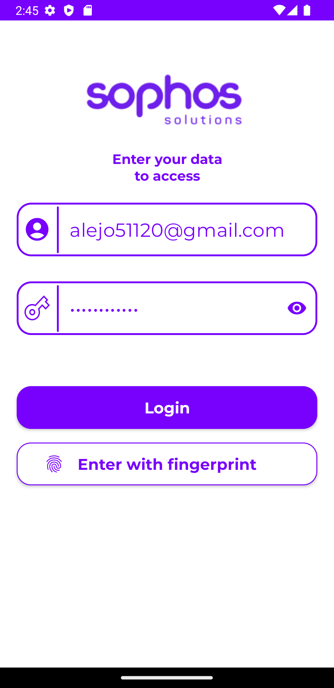
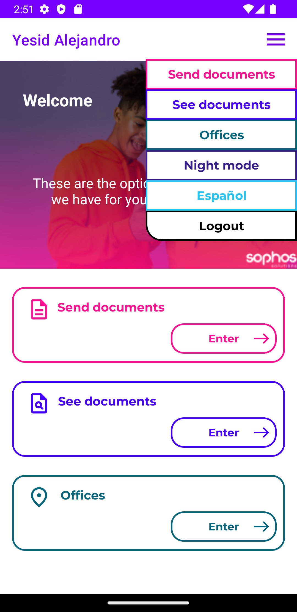
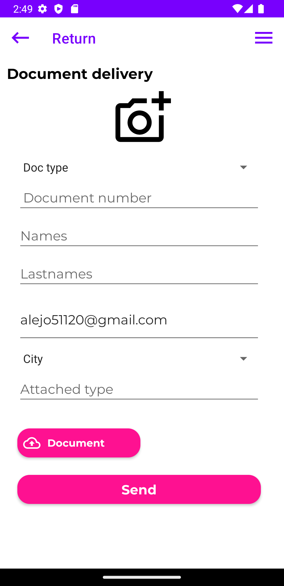
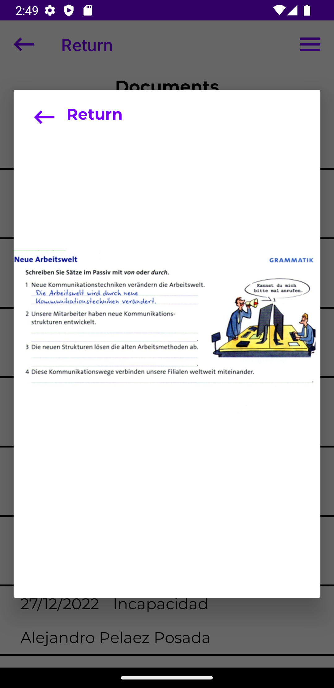
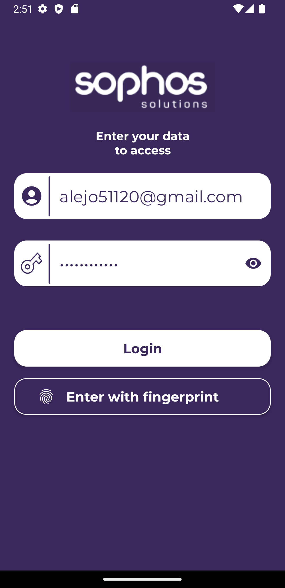
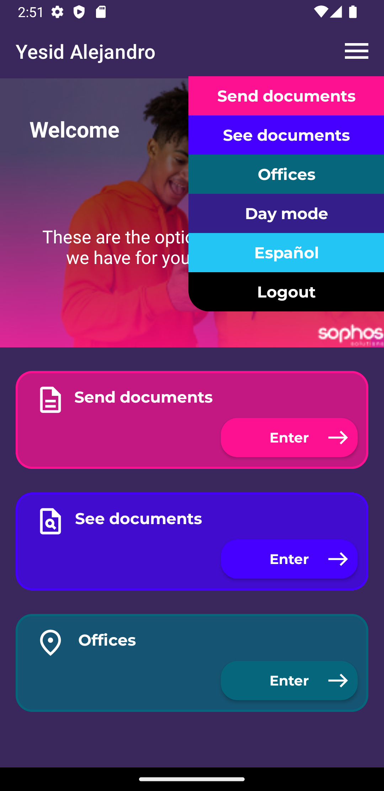
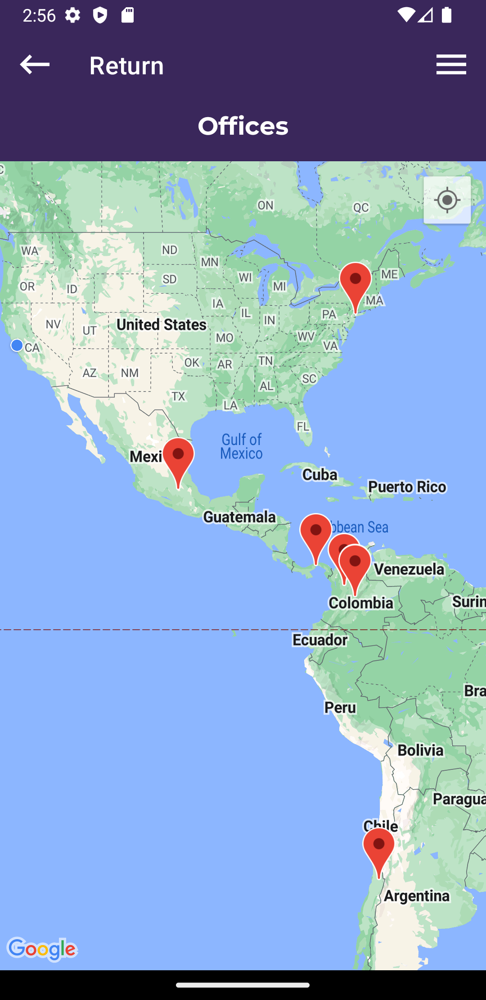
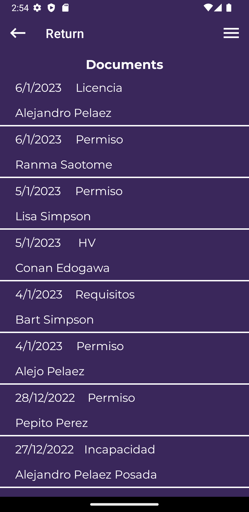

# Sophos Mobile App

## Description
Sophos app is an app that allow users upload documentation required by the company to a webserver. The user will be able to see all documents it has uploaded previously.

## What can you do?
- Take photos with the default camera and send them to a server.
- Authenticate with traditional login or biometrics (fingerprint).
- View the company offices throughout Google Maps.
- Fill a simple form to upload documents.
- Visualize the documents a user has sent before.
- Change the app's language dynamically.
- Set a light or dark mode

## O.S

## Programming language

## Screenshoots (light mode)
   

## Screenshoots (dark mode)
   
